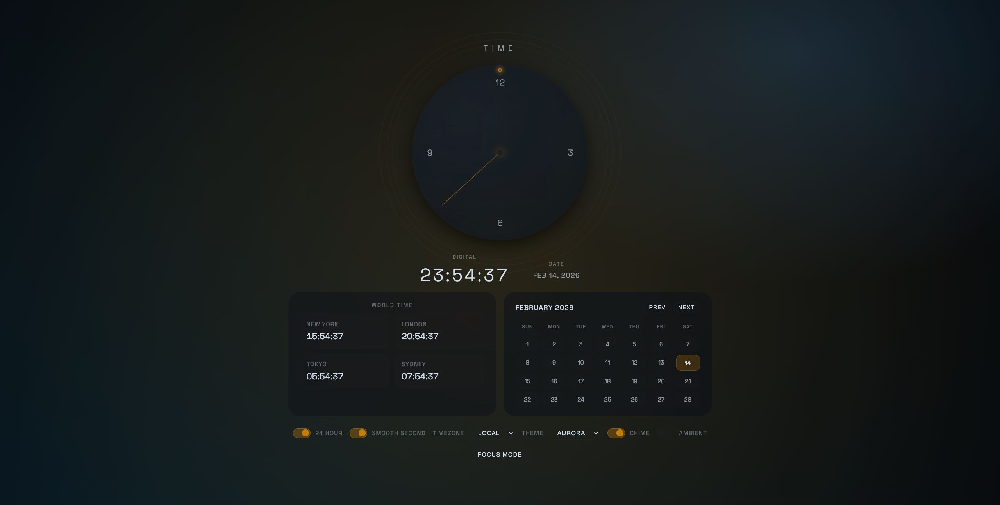

# Modern Clock

A modern analog + digital clock with a glassmorphism face, smooth animation options, and timezone control. Built with plain HTML, CSS, and JavaScript.

This README is intentionally detailed so you can understand how each feature works, where it lives in the code, and what to change if you want to customize behavior or visuals.

## Features
- Analog clock with minimalist markers and 12/3/6/9 numerals
- Digital time + date display
- 24-hour / 12-hour toggle
- Smooth or ticking second hand
- Local or UTC timezone switch
- World time panel (New York, London, Tokyo, Sydney)
- Theme presets (Aurora, Desert, Steel)
- Sunrise/sunset ring with live sun position (uses geolocation if allowed)
- Seconds progress ring
- Calendar panel with month navigation
- Focus Mode (with quick exit button)
- Ambient mode (slow hue shift)
- Chime toggle (beep on the minute)
- Settings persistence via `localStorage`
- Responsive geometry for markers and numerals
- Reduced-motion support

## How It Works (Detailed)

### Clock Core
- `script.js` drives a continuous `requestAnimationFrame` loop.
- Each frame calls `updateClock()`, which:
  - Computes the current time (local or UTC).
  - Calculates the hand angles.
  - Updates the analog hands and the digital display.
  - Refreshes supporting panels and rings.

### Analog Hands
- The analog clock uses three absolutely positioned elements:
  - `.hour-hand`
  - `.minute-hand`
  - `.second-hand`
- Each hand is rotated using CSS `transform: rotate(...)` based on the time.
- Smooth mode interpolates fractions of seconds/minutes for a fluid sweep.

### Digital Time + Date
- Digital time is formatted with `Intl.DateTimeFormat` so it honors the 12/24h toggle and timezone.
- The date is also formatted with `Intl.DateTimeFormat` and converted to uppercase for styling.

### World Time Panel
- The panel lists four fixed IANA time zones.
- On each frame, the panel updates with a new `Intl.DateTimeFormat` instance for each zone.
- You can add more time zones by editing the `timezones` array in `script.js`.

### Theme System
- Themes are implemented via CSS class toggles on `<body>`:
  - `theme-aurora`
  - `theme-desert`
  - `theme-steel`
- Each theme overrides CSS variables like `--accent` and `--bg-deep`.
- The active theme persists via `localStorage`.

### Sunrise/Sunset Ring
- If the user grants location permission, sunrise and sunset are calculated with a simplified solar algorithm.
- The ring is rendered using a CSS `conic-gradient`, highlighting the daylight arc.
- A dot marker rotates to show the current sun position.
- If location isn’t available, the ring is faded to a low-opacity state.

### Seconds Progress Ring
- A second `conic-gradient` fills 0–360° each minute.
- The fill updates every frame in smooth mode or every second in tick mode.

### Calendar Panel
- A calendar grid is generated by `buildCalendar()`.
- It highlights today’s date, and you can navigate months with Prev/Next.
- The header shows the active month/year in a localized format.

### Focus Mode
- Focus Mode hides the extra panels and enlarges the clock.
- Toggled by the “Focus Mode” button or the floating “Exit Focus” button.
- The toggle state persists in `localStorage`.

### Ambient Mode
- Ambient mode applies a slow hue shift using CSS `filter: hue-rotate(...)`.
- The effect updates incrementally each animation frame.

### Chime
- A short sine-wave beep plays on the minute when enabled.
- Uses the Web Audio API with a low attack and short decay.

### Reduced Motion
- If `prefers-reduced-motion` is enabled, smooth seconds are forced off.
- This reduces overall motion and avoids continuous sweeping.

## Run Locally
1. Open `index.html` directly in your browser.
2. Or run a local server in this folder:
   - `python3 -m http.server 8000`
   - Then open `http://localhost:8000`

## Project Structure
- `index.html`: Markup and controls
- `styles.css`: Visual design and animations
- `script.js`: Clock logic, formatting, and responsiveness
- `README.md`: Usage + documentation (this file)

## Customization Tips
- Change fonts in `styles.css` by editing the `@import` and `font-family` on `body`.
- Add or remove themes by copying a `body.theme-*` block.
- Modify the world time list in `script.js`:
  - Update the `timezones` array.
- Adjust the clock size by editing `.clock-container` and ring sizes in CSS.
- Tune the chime volume by changing `masterGain.gain.value` in `initAudio()`.

## Notes
- Uses `requestAnimationFrame` for smooth animation.
- Time formatting is handled with `Intl.DateTimeFormat`.
- Sunrise/sunset ring requires location permission.
- All settings persist in `localStorage` under the key `modernClockSettings`.
